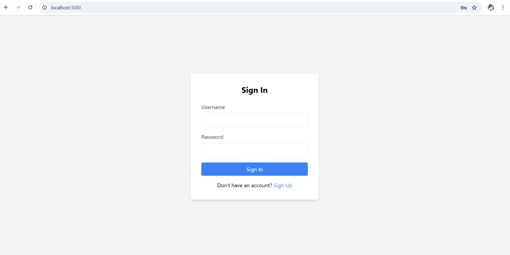
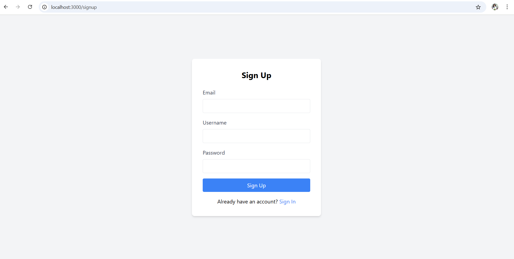
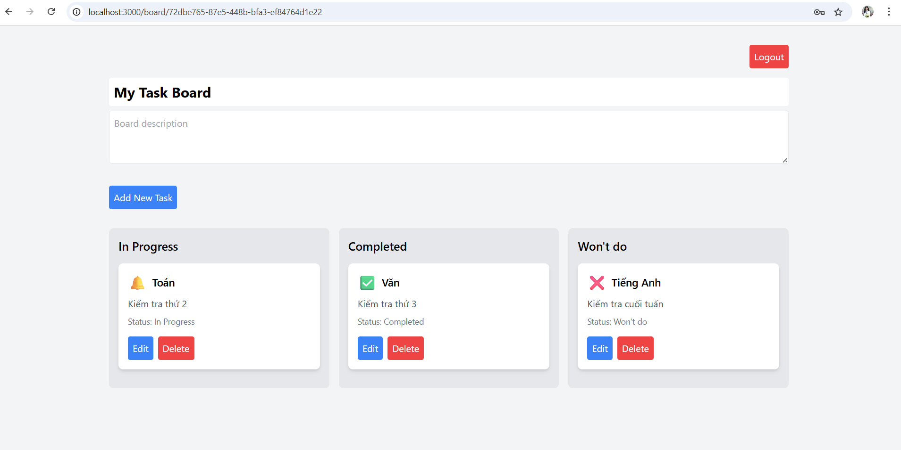

Task Board - Ứng Dụng Quản Lý Công Việc
Task Board là một ứng dụng web đơn giản giúp người dùng quản lý công việc cá nhân. Người dùng có thể đăng ký, đăng nhập, xem danh sách công việc (board), thêm, chỉnh sửa, xóa công việc, và quản lý board. Ứng dụng được xây dựng với React (front-end), Node.js/Express (back-end), và PostgreSQL làm cơ sở dữ liệu.
Tổng Quan
Ứng dụng bao gồm các tính năng chính:

Đăng ký tài khoản với email, username, và password.
Đăng nhập bằng username và password.
Xem board với 4 công việc mặc định (Task in Progress, Task to do, Task Completed, Task Won't Do).
Thêm, chỉnh sửa (tên, mô tả, icon, trạng thái), và xóa công việc.
Chỉnh sửa tên và mô tả board.
Board được truy cập bằng ID duy nhất (UUID).

Công Nghệ Sử Dụng

Front-end: React, Zustand (quản lý trạng thái), Tailwind CSS (giao diện).

Back-end: Node.js, Express, Sequelize (ORM).

Database: PostgreSQL.

Khác: UUID (tạo ID duy nhất), bcrypt (mã hóa mật khẩu).

Dưới đây là một số hình ảnh minh họa của ứng dụng:
Trang Đăng Nhập

Trang Đăng Ký

Trang Board

Tác Giả

Tên: Trần Diệu Quỳnh
Ngày hoàn thành: 29/05/2025

